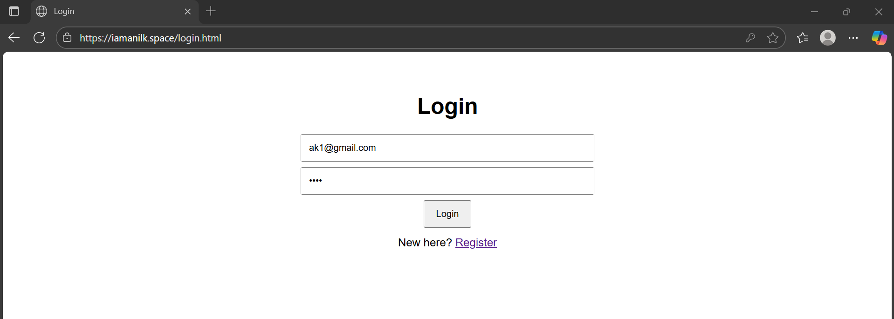

# Scenario 2: Multi-Tier Si```

## Access
- **HTTP**: `httpHow to test
- After apply, note the output `alb_dns`.
- If using HTTPS + custom domain, you won't use ALB DNS; see below. Otherwise, open http://ALB_DNS/ for frontend and http://ALB_DNS/api/ (or /api/api.php) for backend.

## Application Screenshots

Here's what the Simple Login application looks like when deployed:

### 1. Landing Page (Frontend)


### 2. User Registered


### 3. Login Page  


### 4. Success Page (After Login)


Save your screenshots in the `images/` folder with the above filenames to display them.

Notesl- **CI/CD**: CodePipeline for automated deployments

### HTTPS Setup
Set `enable_https = true` and `domain_name = "iamanilk.space"` in tfvars. Update your domain's nameservers to the Route53 values from Terraform outputs.

### Containerization
Build and push Docker images to ECR, then update `container_image_tag` variable to deploy.TPS**: `https://iamanilk.space/` (after DNS delegation)
- **API**: `/api/*` routes to backend

## Testing Fault Tolerance
1. **Instance failure**: Terminate EC2 instances via console
2. **Health checks**: Stop services on instances  
3. **Load testing**: Generate traffic to trigger autoscaling
4. **DB failover**: Force RDS reboot (if Multi-AZ enabled)

Monitor via CloudWatch: `HealthyHostCount`, `RequestCount`, `TargetResponseTime`

---

## Additional Features (Optional)
- **Containerization**: ECR integration with Docker imageson

Deploy a scalable Simple Login web application with frontend, backend API, and MySQL database on AWS using Terraform.

## Architecture
- **Network**: VPC with public/private subnets across 2 AZs  
- **Load Balancer**: ALB with path-based routing (`/` → frontend, `/api/*` → backend)
- **Compute**: Auto Scaling Groups for frontend and backend EC2 instances (1-4 instances each)
- **Database**: RDS MySQL in private subnets
- **Security**: Layered security groups, IAM roles
- **Scaling**: Request-based autoscaling with CloudWatch alarms

## Quick Deploy
```bash
cd scenario2
terraform init
terraform plan
terraform apply
```

## Essential Variables (terraform.tfvars)
```hcl
project_name = "simple-login"
region = "ap-south-1"
key_name = "your-keypair"
domain_name = "iamanilk.space"  # for HTTPS
enable_https = true
max_size = 3
key_name = "your-ec2-keypair"
db_instance_class = "db.t3.micro"
db_engine_version = "8.0.32"
db_name = "appdb"
db_multi_az = false
db_allocated_storage = 20
db_max_allocated_storage = 100

How to test
- After apply, note the output `alb_dns`.
- If using HTTPS + custom domain, you won’t use ALB DNS; see below. Otherwise, open http://ALB_DNS/ for frontend and http://ALB_DNS/api/ (or /api/api.php) for backend.

Notes
- NAT Gateways are created per AZ to allow private instances to reach the Internet for updates, improving availability.
- This is an opinionated, minimal example to bootstrap the infrastructure. It uses Launch Templates + ASG for compute.
- Provide an SSH key in `key_name` for debugging access if needed.
- Review security groups before applying to ensure they meet your security posture.

Using your domain with HTTPS (Route 53 + ACM)
1) In terraform.tfvars, set:
	enable_https       = true
	domain_name        = "iamanilk.space"
	create_hosted_zone = true
	hosted_zone_id     = ""
2) terraform apply
3) After apply, copy the `name_servers` output. Go to your domain registrar for iamanilk.space and update the domain’s nameservers to those four Route 53 NS values.
4) Wait for DNS propagation (can take up to 30–60 minutes). The ACM DNS validation record is created automatically; once propagated, the certificate becomes “Issued”.
5) Browse to https://iamanilk.space — HTTP will redirect to HTTPS automatically.

If you already have a Zone in Route 53
Set:
	enable_https       = true
	domain_name        = "iamanilk.space"
	create_hosted_zone = false
	hosted_zone_id     = "ZXXXXXXXXXXXXX"  # your existing zone id

Containerization and ECR
This repo now includes Dockerfiles for the frontend (static Nginx) and backend (PHP-Apache). Terraform provisions a single ECR repository and updates EC2 user_data to pull and run images. Images are distinguished by tag prefixes: frontend-<tag> and backend-<tag>.

Build and push images (Windows cmd)
Prereqs: Docker Desktop, AWS CLI configured (aws configure), and Terraform applied to create ECR repos.

1) Get the ECR repo URI from outputs:
	- ecr_repo

2) Authenticate Docker to ECR:
	aws ecr get-login-password --region %AWS_REGION% | docker login --username AWS --password-stdin <ACCOUNT_ID>.dkr.ecr.%AWS_REGION%.amazonaws.com

  Alternatively, derive the registry from the repo URI:
	for /f "tokens=1 delims=/" %i in ("%ECR_REPO%") do set ECR_REG=%i
	aws ecr get-login-password --region %AWS_REGION% | docker login --username AWS --password-stdin %ECR_REG%

3) Build and push frontend:
	docker build -t %ECR_REPO%:frontend-latest app\frontend
	docker push %ECR_REPO%:frontend-latest

4) Build and push backend:
	docker build -t %ECR_REPO%:backend-latest app\backend
	docker push %ECR_REPO%:backend-latest

Notes
- Set environment variables before running (example):
	set AWS_REGION=ap-south-1
	set ECR_REPO=<repo from output ecr_repo>
- To deploy a different tag, set container_image_tag in terraform.tfvars and push images tagged frontend-<tag> and backend-<tag>.

Local development with Docker Compose
- Requires a MySQL instance reachable from your machine if you want to test backend. For quick smoke tests without MySQL, backend endpoints will return 500 for DB operations.
  docker compose up --build
  Frontend: http://localhost:8080
  Backend:  http://localhost:8081

Deploying containers
- After pushing images, either scale in/out the ASGs or trigger instance refresh to make user_data pull the new tag. Changing `container_image_tag` and applying Terraform will roll new instances.
- ALB routes `/` to frontend and `/api/*` to backend. Frontend assets include index.html and login.html that call `/api/*` endpoints.

